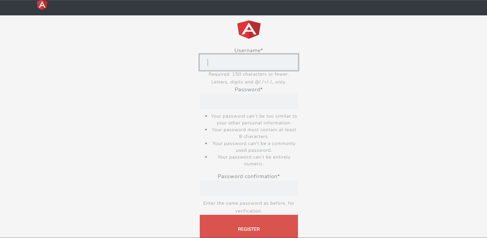
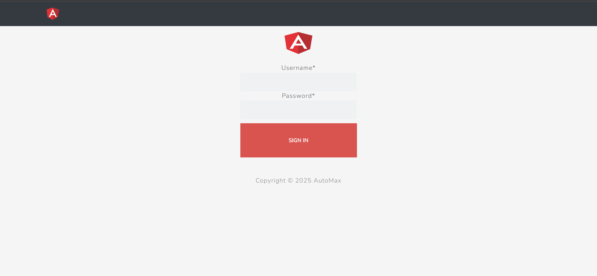
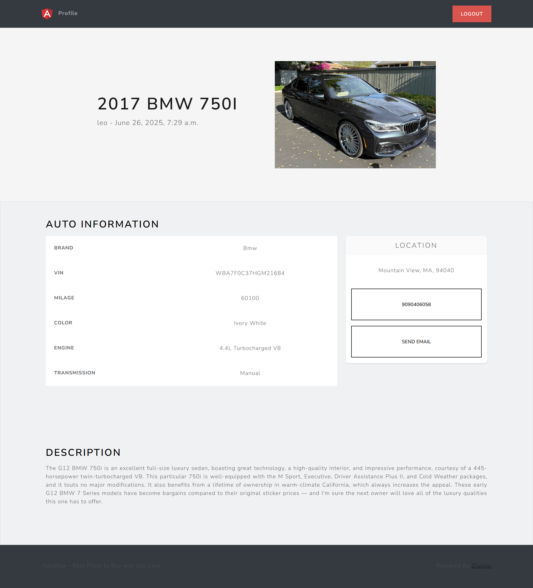

# 🚗 Automax Car Sale and Listing Platform

**Automax** is a full-stack web application built to simplify the process of car listing, buying, and selling. This platform enables users to register, post car listings with details and images, browse vehicles, and connect with sellers.

## Automax App

---

## 🌟 Features

- 🔐 User authentication (Register/Login)
- 🚘 Car listing creation with images and descriptions
- 🔍 Browse cars with search and filter capabilities
- 📬 Contact seller via email (SMTP configuration required)
- 🧾 View personal listing history and edit/delete cars
- 📱 Fully responsive user interface
- 💾 PostgreSQL database integration (setup required)
- ☁️ Ready for deployment

---

## 🛠 Tech Stack

- Python, Django
- HTML, CSS, Bootstrap
- PostgreSQL (coming soon)
- Deployed on: (to be added)
---

