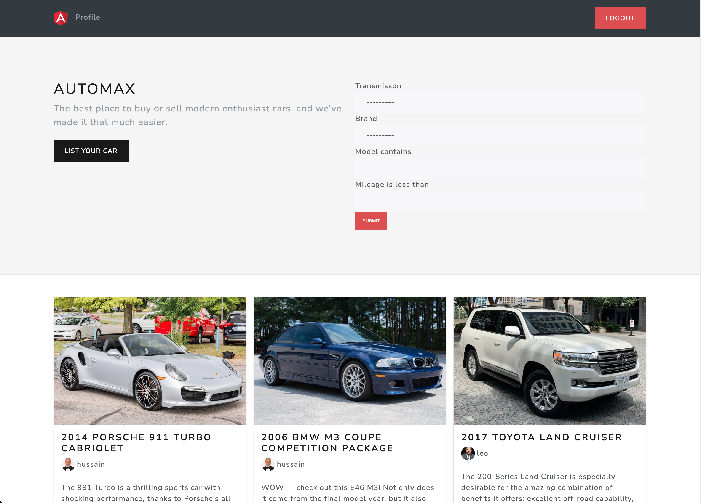

# 🚗 Automax Car Sale and Listing Platform

**Automax** is a full-stack web application built to simplify the process of car listing, buying, and selling. This platform enables users to register, post car listings with details and images, browse vehicles, and connect with sellers.

---

## 📸 Automax App Screenshots

| Home | Register | Sign In |
|------|----------|---------|
|  |  |  |

| Listings | Profile |
|----------|---------|
|  |  |

---

## 🌟 Features

- 🔐 User authentication (Register/Login)
- 🚘 Car listing creation with images and details
- 🔍 Browse cars with search and filter options
- 📬 Contact seller via email (SMTP setup required)
- 🧾 View and manage personal listings
- 📱 Fully responsive user interface
- 💾 PostgreSQL database integration (pending)
- ☁️ Deployment ready

---

## 🛠 Tech Stack

- **Backend:** Python, Django
- **Frontend:** HTML, CSS, Bootstrap
- **Database:** PostgreSQL (integration in progress)
- **Version Control:** Git & GitHub
- **Deployment:** *(Coming soon)*

---
